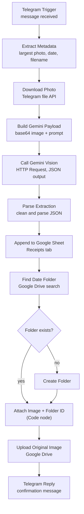
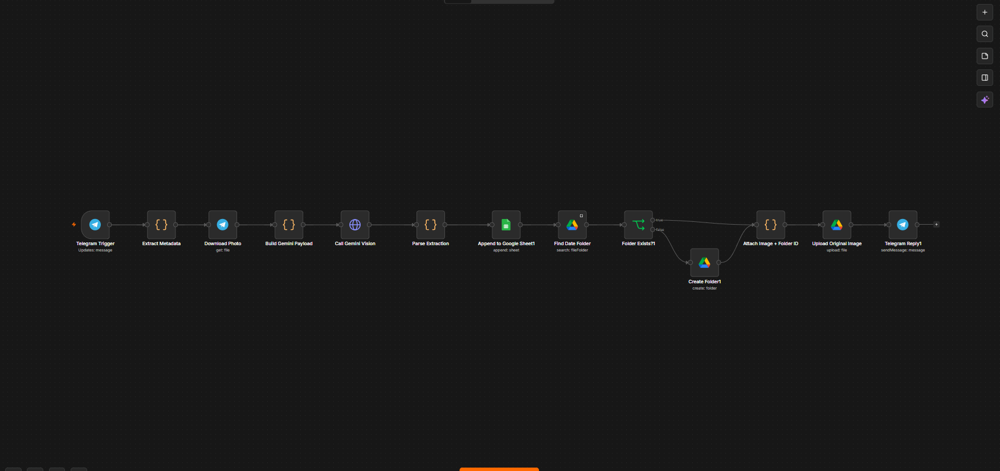

# Telegram Receipt Logger (n8n + Gemini Vision)

Send a photo of a receipt to a Telegram bot. An n8n workflow reads it with Google's Gemini vision model, logs the merchant, amount, currency and date to a Google Sheet, saves the original photo to a date-named folder in Google Drive, and replies in Telegram to confirm.

<!-- Add your demo GIF or video link here -->


## The problem

Receipts pile up as photos and paper. Entering them by hand into a spreadsheet is slow and easy to forget, and the original image is hard to find later when you need proof of purchase. This workflow turns "snap a photo and send it" into a logged, filed record.

## What it does

1. You send a receipt photo to the Telegram bot.
2. The workflow downloads the photo and sends it to Gemini, which returns the merchant, amount, currency and transaction date as JSON.
3. One row is appended to the `Receipts` tab of a Google Sheet.
4. The original photo is uploaded to a Google Drive folder named after the submission date (`YYYY-MM-DD`). The folder is created if it doesn't exist.
5. The bot replies with a confirmation, for example:

```
✅ Receipt Logged!
Merchant: Sample Cafe
Amount: 245.50 PHP
```

## Architecture



<!-- Add a screenshot of your n8n canvas here -->


## Data logged

Each receipt becomes one row in the `Receipts` tab:

| Column | Source |
|---|---|
| merchant | Extracted by Gemini |
| amount | Extracted by Gemini |
| currency | Extracted by Gemini |
| transactionDate | Date on the receipt, extracted by Gemini (`YYYY-MM-DD`) |
| submissionDate | The day the photo was sent (UTC) |
| folderName | Drive folder the photo was saved in (same as submissionDate) |
| fileName | `receipt_<submissionDate>_<chatId>.jpg` |
| chatId | Telegram chat the photo came from |

Example row (sample data):

| merchant | amount | currency | transactionDate | submissionDate | folderName | fileName | chatId |
|---|---|---|---|---|---|---|---|
| Sample Cafe | 245.50 | PHP | 2026-09-20 | 2026-09-21 | 2026-09-21 | receipt_2026-09-21_123456789.jpg | 123456789 |

## Design decisions

**Largest photo size.** Telegram sends each photo in several resolutions. The workflow takes the last entry in the array, which is the largest, so the receipt text stays readable for the model.

**Gemini through an HTTP Request node.** Calling the REST API directly gives full control over the request: the image is sent as base64 `inlineData`, and `responseMimeType: application/json` asks for machine-readable output. The API key comes from an environment variable (`GEMINI_API_KEY`), so it is never stored in the workflow file.

**Defensive JSON parsing.** Even in JSON mode, models sometimes wrap output in Markdown code fences. The parse step strips them before `JSON.parse`.

**Find-or-create date folder.** A Drive search looks for a folder named with the date. The search node is set to always output an item, even when nothing is found, so an IF node can branch on whether an ID came back. Both branches merge into the same next step.

**Re-attaching the original image.** The Drive nodes return only JSON, so the photo's binary data is lost after the folder lookup. A Code node pulls the image back from the Download Photo node and pairs it with the folder ID for upload.

**Confirm only at the end.** The Telegram reply is the last node, so a confirmation means the whole pipeline (extraction, sheet row and Drive upload) succeeded.

## Setup

1. **Telegram bot:** create one with [@BotFather](https://t.me/BotFather) and copy the token.
2. **Public HTTPS URL for n8n:** the Telegram trigger works by webhook, so Telegram must be able to reach your n8n. Use n8n Cloud, a server with a domain, or a stable tunnel, and set `WEBHOOK_URL` to that address. Free quick tunnels change address on every restart, which breaks the webhook.
3. **Gemini API key:** create one in Google AI Studio and set it as the environment variable `GEMINI_API_KEY` on your n8n instance. If your n8n blocks environment access in nodes, set `N8N_BLOCK_ENV_ACCESS_IN_NODE=false` or move the key into an n8n credential.
4. **Google credentials:** create OAuth2 credentials for Google Sheets and Google Drive in n8n.
5. **Google Sheet:** create a sheet with a tab named `Receipts`. Put these headers in row 1, spelled exactly: `merchant`, `amount`, `currency`, `transactionDate`, `submissionDate`, `folderName`, `fileName`, `chatId`.
6. Import `workflow/telegram-receipt-photo-processing.json`, attach the credentials, and select your sheet in the Google Sheets node.
7. Activate the workflow, then send a receipt photo to your bot.

## Testing

See [docs/test-plan.md](docs/test-plan.md).

## Known limitations

- **Photos only.** The trigger listens to all messages. A text message, or a photo sent as a file (not as a photo), makes the workflow error out with "No photo found", and the sender gets no reply.
- **No error feedback to the user.** If Gemini, the sheet or Drive fails, the execution fails silently from the sender's point of view.
- **Submission date is UTC.** The folder date comes from `new Date().toISOString()`, so a receipt sent between midnight and 8 AM in the Philippines lands in the previous day's folder.
- **Same filename for same-day receipts.** Files are named `receipt_<date>_<chatId>.jpg`, so two receipts from one chat on one day share a name. Drive keeps both, but they can't be told apart by name.
- **No access control.** Anyone who finds the bot can submit photos, which then go to your sheet, your Drive and the Gemini API. The workflow doesn't check the sender's chat ID.
- **Unvalidated extraction.** Gemini's output is not checked against a schema. If the model uses different key names or misreads a total, the wrong value is logged. Amounts are stored as text.
- **Partial failure.** The sheet row is written before the Drive upload, so a Drive failure leaves a row with no stored image.
- **Concurrent uploads.** If two receipts arrive at the same moment on a new day, both may create the date folder.
- **No duplicate detection.** Sending the same receipt twice logs it twice.

## Possible improvements

- Restrict the trigger to allowed chat IDs
- Reply with a helpful message when the input isn't a photo or extraction fails
- Use Gemini's response schema so the output keys and types are guaranteed
- Use the local date for folders and add a unique suffix to filenames
- Add a review step for low-confidence extractions
- Monthly totals or a category breakdown in the sheet

## Tech

n8n · Telegram Bot API · Google Gemini API · Google Sheets API · Google Drive API · JavaScript (n8n Code nodes)

## Author

<!-- Your name, portfolio link and LinkedIn -->
